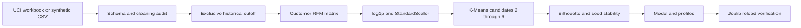

# Customer Segmentation & Retention Analysis

RFM feature engineering and reproducible K-Means segmentation for retail retention prioritization.
Day 1 delivers the offline analytics engine. Dashboard completion and public deployment are Day 2 work; no live app is published yet.

## Reproduce Day 1

Use Python 3.12 and run from the repository root:

```powershell
python -m venv .venv
.\.venv\Scripts\Activate.ps1
python -m pip install -r requirements-day1.txt
python scripts/download_data.py
python -m pytest tests -q
python scripts/train_rfm.py --input "data/Online Retail.xlsx" --as-of 2011-12-10
```

Fallback: run `python scripts/generate_synthetic.py`, then train with
`python scripts/train_rfm.py --input data/synthetic_online_retail.csv`.
Synthetic results demonstrate execution only, not actual customer findings.

## Architecture



## Analytical choices

- **Recency:** calendar days since the latest eligible purchase.
- **Frequency:** unique invoices, not line items.
- **Monetary:** gross positive purchase value, in GBP for UCI. Returns are excluded; this is not net revenue, profit, or lifetime value.
- **Cutoff:** only transactions strictly before `--as-of` enter RFM. The default is midnight after the final transaction day. Historical evaluation must supply its own cutoff.
- **Cleaning:** exclude missing required fields, blank invoices, cancellations, nonpositive/nonfinite sales inputs. Exact full-row duplicates are removed only when StockCode is available, to avoid merging different products in reduced schemas. A sequential audit records disjoint removal counts.
- **Transformation:** log1p reduces skew; standardization gives the three features comparable weight. Extreme customers remain for business review.
- **Selection:** choose maximum sampled silhouette over k=2..6 (fixed seed; up to 2,000 customers), or override with `--clusters`. Inertia supports elbow inspection. Mean adjusted Rand index across three alternate seeds measures initialization stability, not temporal stability.
- **Interpretation:** cluster IDs have no inherent order. Naming and campaign recommendations require profile review. Small clusters, wholesaler effects, and correlation between frequency and spend deserve attention.

## Saved artifacts

The verified UCI run produced **4,338 customer profiles** and selected **k=2**, with
sampled silhouette **0.425188**. See [Day 1 findings and test evidence](reports/day1_results.md).

`artifacts/` contains the fitted preprocessing/model pipeline, RFM matrix, customer assignments,
cluster profiles, model comparison, data-quality audit, and metadata (input hash, cutoff, versions,
parameters and selection rule). Training reloads the saved model and checks all customer predictions.
Load only trusted joblib files and use the recorded dependency versions.

## Limitations and next milestone

These historical UK transactions include wholesalers and do not establish current Canadian customer behavior.
Tenure and acquisition timing affect frequency/spend; unidentified customers and excluded returns affect coverage.
Segments summarize behavior. They do not estimate churn probability or prove campaign revenue lift.
Temporal backtesting, treatment/control experiments, and supervised churn modeling are outside Day 1.

Day 2 adds the Streamlit explorer, guarded customer scoring, 2D/3D plots, model evidence,
CSV download, and business action guidance. Run locally with `streamlit run app.py` after training.
Public deployment link: https://9m6lwof6hxjytvgqw4fah5.streamlit.app/

## Data credit

Chen, D. (2015). **Online Retail**, UCI Machine Learning Repository.
[Dataset and CC BY 4.0 license](https://archive.ics.uci.edu/dataset/352/online+retail).
[DOI: 10.24432/C5BW33](https://doi.org/10.24432/C5BW33).
The raw workbook is downloaded locally and excluded from Git.

